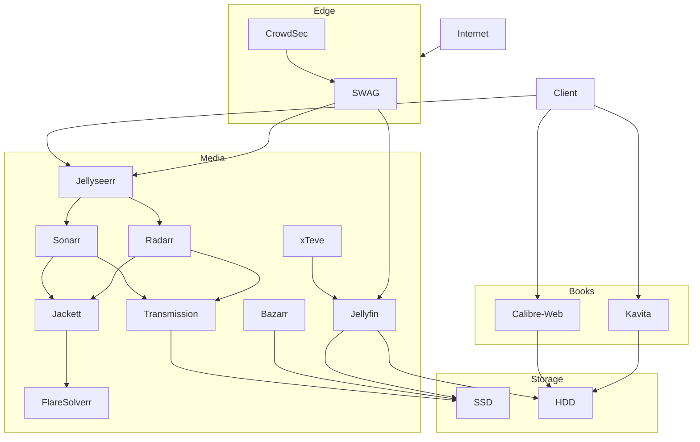

## Intro

This server did not start as a media center. It started as a practical way to read and manage my book collection from any device, and then evolved step by step into a full homelab.

This post documents the current state of the setup, the reasoning behind each piece, and the short history of how it got there.

> Sensitive values in all snippets are replaced with `<REDACTED>` placeholders.

---

## How it evolved

**Phase 0 — VPN first.**
Before anything else, I configured WireGuard so remote administration was private and controlled from the beginning.

**Phase 1 — The book server.**
The whole thing started with Calibre and Kavita. I wanted my ebook library accessible from any device without relying on third-party clouds.
Calibre-Web for library management. Kavita for reading. Both pointing at the same folder on an external HDD.

**Phase 2 — Automation first.**
Before any `jelly*` services, I built the automation framework first with Transmission, Jackett, Sonarr, and Radarr. The original goal was still portability and low-maintenance content management, and this stack gave me that foundation.

**Phase 3 — Jellyfin and Jellyseerr on top.**
Once automation was stable, I added Jellyfin for playback and Jellyseerr as the request front-end. At that point, the pipeline was complete end-to-end.

**Phase 4 — Hardening and ops.**
Once the services were useful enough to be worth protecting, SWAG and CrowdSec came in for the reverse proxy and threat detection layer. WireGuard was already in place for private remote access. Watchtower kept images updated, and Homepage, Portainer, Dozzle, and other tools reduced day-to-day SSH firefighting.

---

## Storage: NTFS drives with fstab mounts

Both external drives — an SSD and an HDD — are formatted as NTFS. This is intentional: NTFS gives excellent portability across operating systems, with straightforward support on Windows and Linux, and workable compatibility on macOS when needed. This matters when you want to unplug a drive and use it on another machine while travelling.

The drives are mounted persistently via `/etc/fstab` using `ntfs-3g`:

```text
# External HDD
UUID="<REDACTED>" /mnt/hdd/ ntfs-3g nosuid,nodev,nofail,noatime,nodiratime,uid=1000,gid=1000,rw 0 0

# External SSD
UUID="<REDACTED>" /mnt/ssd/ ntfs-3g nosuid,nodev,nofail,noatime,nodiratime,uid=1000,gid=1000,rw 0 0
```

A few things worth noting about these options:

- `nofail` — if a drive is not plugged in at boot, the system still starts normally. Useful if you have unplugged the drive temporarily.
- `noatime` / `nodiratime` — disables access-time writes on every file read, which reduces unnecessary write load on both drives.
- `uid=1000` / `gid=1000` — maps the drive ownership to your host user, so Docker containers running with the same `PUID`/`PGID` can read and write without permission issues.

The SSD holds active/recent media and downloads. The HDD holds the full book library and overflow media. This split means the most-accessed content stays on the faster drive.

---

## Folder layout and compose convention

Every service lives in its own folder under the home directory, with `docker-compose.yml` at the folder root and service data beside it:

```text
~/
├── calibre-web/
│   ├── docker-compose.yml
│   └── config/
├── kavita/
│   ├── docker-compose.yml
│   └── config/
├── homepage/
│   ├── docker-compose.yml
│   ├── config/
│   └── secrets/
├── netalertx/
│   ├── docker-compose.yml
│   ├── config/
│   ├── db/
│   └── logs/
├── watchtower/
│   └── docker-compose.yml
├── swag/
│   ├── docker-compose.yml
│   └── config/
└── ...
```

Each compose file is self-contained. This keeps `docker compose up -d` and `docker compose down` scoped to one service, which makes debugging and updating much less stressful.
Services that need persistent state have dedicated local directories (like `config`, `db`, `logs`, or `secrets`), while others (for example `watchtower`) only need the compose file plus host mounts.

Most containers share the same conventions:

- `restart: unless-stopped`
- Explicit port mappings
- `PUID` / `PGID` matching the host user for consistent file permissions across bind mounts

---

## Architecture overview



> **Note:** This diagram shows the **primary user/content flow**, not every available web UI. Most services here (including Transmission, Sonarr, Radarr, Jackett, and others) also expose their own web interfaces for administration.

---

## Books stack

### Calibre-Web

Calibre-Web gives you a web interface for your Calibre library. You can browse, search, read in the browser, and send books to e-readers. It also supports OPDS, so any e-reader app that understands the standard can connect directly.

The important `DOCKER_MODS` line adds the actual Calibre binaries inside the container — this enables server-side format conversion (for example, converting an EPUB to MOBI before sending it to a Kindle).

```yaml
services:
  calibre-web:
    image: lscr.io/linuxserver/calibre-web:latest
    environment:
      - PUID=1000
      - PGID=1000
      - TZ=<REDACTED>
      - DOCKER_MODS=linuxserver/mods:universal-calibre
    volumes:
      - ./config:/config
      - /mnt/hdd/Calibre/Books:/books
    ports:
      - 8083:8083
    restart: unless-stopped
```

The books live on the HDD (`/mnt/hdd/Calibre/Books`). Since this is NTFS, I can unplug the HDD, plug it into any Windows or macOS machine, and access the full library natively — no conversion, no syncing.

### Kavita

Kavita is a fast, clean reader server. Where Calibre-Web is focused on library management, Kavita is focused on the reading experience itself. It also handles comics and manga well, which Calibre-Web does not.

Both services point at the same HDD path, so the same files are accessible from either.

```yaml
services:
  kavita:
    image: lscr.io/linuxserver/kavita:latest
    environment:
      - PUID=1000
      - PGID=1000
      - TZ=<REDACTED>
    volumes:
      - ./config:/config
      - /mnt/hdd/Calibre:/data
    ports:
      - 5000:5000
    restart: unless-stopped
```

Note that Kavita mounts the parent `Calibre` folder (`/mnt/hdd/Calibre`) rather than just `Books`, so it can pick up subdirectories for different content types.

---

## Media stack

### Jellyfin

Jellyfin is the video playback server. It reads from both SSD and HDD paths, so recent content stays on the faster drive while older content lives on the HDD.

I pass through `/dev/dri` for Intel iGPU hardware acceleration. On lower-power hardware this makes a real difference — transcoding a 4K stream without it would be painful.

```yaml
services:
  jellyfin:
    image: lscr.io/linuxserver/jellyfin:latest
    environment:
      - PUID=1000
      - PGID=1000
      - TZ=<REDACTED>
      - JELLYFIN_PublishedServerUrl=https://<REDACTED>
      - LIBVA_DRIVER_NAME=iHD
    volumes:
      - ./config:/config
      - /mnt/ssd/Series:/data/tvshows
      - /mnt/hdd/Series:/data/tvshows_hdd
      - /mnt/ssd/Movies:/data/movies
      - /mnt/hdd/Movies:/data/movies_hdd
    devices:
      - /dev/dri:/dev/dri
    group_add:
      - "105" # render group
      - "44"  # video group
    networks:
      - swag-net
```

The `group_add` entries give the container access to the DRI device nodes. Get the correct GIDs for your system with `getent group render video`.

### Jellyseerr

Jellyseerr is the request interface for Jellyfin. Users log in, search for what they want, and it forwards the request to Sonarr or Radarr automatically. Non-technical users never need to touch the Arr dashboards — they click "Request" and content appears in Jellyfin once it is downloaded and imported.
I also route Jellyseerr request events/notifications to Discord, so I get a quick signal when new content requests come in.

```yaml
services:
  jellyseerr:
    image: fallenbagel/jellyseerr:latest
    environment:
      - LOG_LEVEL=info
      - TZ=<REDACTED>
      - PORT=5055
    ports:
      - 5055:5055
    volumes:
      - ./config:/app/config
    restart: unless-stopped
    networks:
      - swag-net
```

### Sonarr and Radarr

Sonarr handles TV series, Radarr handles movies. Both are connected to Jackett for indexers and Transmission for downloads, and mounted to the same paths Jellyfin reads from so imports happen in-place without copying.

The key thing to get right is **path mapping**: the download path inside Sonarr/Radarr must match what Transmission writes to, and the library path must match what Jellyfin reads. Get this consistent from the start — fixing it retroactively is painful.

```yaml
services:
  sonarr:
    image: lscr.io/linuxserver/sonarr:latest
    environment:
      - PUID=1000
      - PGID=1000
      - TZ=<REDACTED>
    volumes:
      - ./config:/config
      - /mnt/ssd/Series:/tv
      - /mnt/hdd/Series:/tv_hdd
      - /mnt/ssd/downloads:/downloads
    ports:
      - 8989:8989
    restart: unless-stopped

  radarr:
    image: lscr.io/linuxserver/radarr:latest
    environment:
      - PUID=1000
      - PGID=1000
      - TZ=<REDACTED>
    volumes:
      - ./config:/config
      - /mnt/ssd/Movies:/movies
      - /mnt/hdd/Movies:/movies_hdd
      - /mnt/ssd/downloads:/downloads
    ports:
      - 7878:7878
    restart: unless-stopped
```

### Bazarr

Bazarr handles subtitle management alongside Sonarr and Radarr. It monitors both libraries and downloads subtitles automatically after import. Mount it against the same media paths so it can write subtitle files next to the video files.

```yaml
services:
  bazarr:
    image: lscr.io/linuxserver/bazarr:latest
    environment:
      - PUID=1000
      - PGID=1000
      - TZ=<REDACTED>
    volumes:
      - ./config:/config
      - /mnt/ssd/Series:/tv
      - /mnt/ssd/Movies:/movies
      - /mnt/ssd/downloads:/downloads
    ports:
      - 6767:6767
    restart: unless-stopped
```

### Jackett and FlareSolverr

Jackett aggregates torrent indexers into a unified API that the Arr apps understand. Configure your indexers once in Jackett instead of separately in each Arr app.

FlareSolverr handles indexers that serve Cloudflare challenge pages. Jackett proxies those requests through it automatically.

```yaml
services:
  jackett:
    image: lscr.io/linuxserver/jackett:latest
    environment:
      - PUID=1000
      - PGID=1000
      - TZ=<REDACTED>
      - AUTO_UPDATE=true
    volumes:
      - ./config:/config
      - /mnt/ssd/downloads:/downloads
    ports:
      - 9117:9117
    restart: unless-stopped

  flaresolverr:
    image: ghcr.io/flaresolverr/flaresolverr:latest
    environment:
      - LOG_LEVEL=info
    ports:
      - 8191:8191
    restart: unless-stopped
```

### Transmission

Transmission is the download client. Sonarr and Radarr send it jobs via API and it writes finished downloads to the shared path the Arr apps watch.

```yaml
services:
  transmission:
    image: lscr.io/linuxserver/transmission:latest
    environment:
      - PUID=1000
      - PGID=1000
      - TZ=<REDACTED>
      - USER=<REDACTED>
      - PASS=<REDACTED>
    volumes:
      - ./config:/config
      - /mnt/ssd/downloads:/downloads
      - /mnt/ssd/torrents:/watch  # drop .torrent files here to auto-add
```

> **Caution:** Keep `USER` and `PASS` in a `.env` file that is added to `.gitignore` if you push compose files to a repo.

### xTeve

xTeve bridges IPTV playlists (M3U) into a format Jellyfin can use as a Live TV tuner. If you have an IPTV subscription, xTeve handles the playlist and guide data (EPG) side so Jellyfin sees it as a proper tuner device.

```yaml
services:
  xteve:
    image: dnsforge/xteve
    container_name: xteve
    ports:
      - 34400:34400
    volumes:
      - ./config:/home/xteve/conf
    environment:
      - TZ=<REDACTED>
    restart: unless-stopped
    networks:
      - swag-net
```

---

## Edge and security layer

### SWAG (reverse proxy + TLS)

SWAG handles Let's Encrypt certificate issuance and renewal automatically. It is the only service that needs ports 80 and 443 open from the internet.

Proxy config files live in `swag/config/nginx/proxy-confs/`. SWAG ships sample configs for most self-hosted apps — copy the `.sample` file, remove the suffix, and it generally works.

```yaml
services:
  swag:
    image: lscr.io/linuxserver/swag
    environment:
      - PUID=1000
      - PGID=1000
      - TZ=<REDACTED>
      - URL=<REDACTED>
      - SUBDOMAINS=<REDACTED>
      - VALIDATION=http
      - DOCKER_MODS=linuxserver/mods:swag-crowdsec|linuxserver/mods:swag-dashboard
      - CROWDSEC_API_KEY=<REDACTED>
      - CROWDSEC_LAPI_URL=http://crowdsec:9090
    volumes:
      - ./config:/config
    ports:
      - 443:443
      - 80:80
    networks:
      - swag-net
```

The `swag-net` Docker network is how SWAG reaches backend containers by name. Any container SWAG needs to proxy must be on this network.

### CrowdSec

CrowdSec reads SWAG's Nginx access logs and identifies malicious patterns (brute forces, CVE scanners, bad bots). It also participates in a community blocklist — IPs flagged by others get blocked for you too.
Operational/security alerts from CrowdSec are forwarded to my Discord channel as part of my day-to-day monitoring workflow.

It integrates with SWAG via a bouncer module, so blocked IPs are rejected at the Nginx layer before they reach your apps.

```yaml
services:
  crowdsec:
    image: crowdsecurity/crowdsec:latest
    environment:
      - GID=1000
      - COLLECTIONS=crowdsecurity/nginx crowdsecurity/http-cve crowdsecurity/whitelist-good-actors
      - BOUNCER_KEY_swag=<REDACTED>
    volumes:
      - ./config:/etc/crowdsec:rw
      - ./data:/var/lib/crowdsec/data:rw
      - ../swag/config/log/nginx:/var/log/nginx:ro
    networks:
      - swag-net
```

The Nginx log directory is mounted read-only from the SWAG config folder — CrowdSec only needs to tail the files, not write to them.

### WireGuard and DuckDNS

Private services (admin UIs, Sonarr, Radarr, etc.) are intended to stay private (LAN/VPN), while public exposure is limited to selected endpoints through the reverse proxy. **DuckDNS** keeps the WireGuard host address up to date when the public IP changes, which happens regularly on residential connections.

```yaml
services:
  wg-easy:
    image: ghcr.io/wg-easy/wg-easy:latest
    environment:
      - WG_HOST=<REDACTED>
      - PASSWORD_HASH=<REDACTED>
      - WG_PORT=51820
    volumes:
      - ./config:/etc/wireguard
    ports:
      - 51820:51820/udp
      - 51821:51821/tcp
    cap_add:
      - NET_ADMIN
      - SYS_MODULE
    restart: unless-stopped

  duckdns:
    image: lscr.io/linuxserver/duckdns:latest
    environment:
      - TZ=<REDACTED>
      - SUBDOMAINS=<REDACTED>
      - TOKEN=<REDACTED>
    volumes:
      - ./config:/config
    network_mode: host
    restart: unless-stopped
```

---

## Operations and observability

| Service | Purpose |
| --- | --- |
| **Portainer** | Docker management UI — start, stop, inspect containers and stacks |
| **Dozzle** | Live log viewer for any container without SSH-ing in |
| **Homepage** | Single dashboard aggregating status and links for all services |
| **Dashdot** | Host-level hardware telemetry (CPU, RAM, disk, network) |
| **Pi-hole** | DNS filtering and local DNS resolution for the whole network |
| **NetAlertX** | Network scanner that alerts on new or unexpected devices |
| **Watchtower** | Automated container image updates on a schedule |

A few notes worth calling out:

**Portainer** mounts the Docker socket read-only (`/var/run/docker.sock:ro`) — enough for inspection and start/stop without giving it full daemon control.

**Pi-hole** has Watchtower disabled via label (`com.centurylinklabs.watchtower.enable=false`). A surprise Pi-hole restart breaks DNS for the whole network, so it gets updated manually.

**Watchtower** runs daily at 5am and sends update notifications to a private Discord channel via a webhook. You get a message listing exactly what changed. This makes automated updates feel a lot safer than finding out something broke silently.

**NetAlertX** is part of the stack for network awareness, and its alerts are also sent to Discord so new/changed devices are visible quickly. In my current setup it is still under tuning and can occasionally require troubleshooting/restarts.

```yaml
# ~/portainer/docker-compose.yml
services:
  portainer:
    image: portainer/portainer-ce:latest
    volumes:
      - /var/run/docker.sock:/var/run/docker.sock:ro
      - ./portainer-data:/data
    ports:
      - 9000:9000
    restart: unless-stopped
```

```yaml
# ~/dozzle/docker-compose.yml
services:
  dozzle:
    image: amir20/dozzle:latest
    volumes:
      - /var/run/docker.sock:/var/run/docker.sock
    ports:
      - 8081:8080
    restart: unless-stopped
```

```yaml
# ~/homepage/docker-compose.yml
services:
  homepage:
    image: ghcr.io/gethomepage/homepage:latest
    env_file:
      - path: /home/<REDACTED>/homepage/secrets/.env
        required: true
    volumes:
      - ./config:/app/config
      - /var/run/docker.sock:/var/run/docker.sock
      - /mnt/hdd:/mnt/hdd:ro
      - /mnt/ssd:/mnt/ssd:ro
    ports:
      - 3000:3000
    restart: unless-stopped
```

```yaml
# ~/dashdot/docker-compose.yml
services:
  dashdot:
    image: mauricenino/dashdot:latest
    privileged: true
    volumes:
      - /:/mnt/host:ro
    ports:
      - 8086:3001
    restart: unless-stopped
```

```yaml
# ~/pi-hole/docker-compose.yml
services:
  pihole:
    image: pihole/pihole:latest
    environment:
      - TZ=<REDACTED>
      - FTLCONF_webserver_api_password=<REDACTED>
    volumes:
      - ./etc-pihole:/etc/pihole
      - ./etc-crontabs:/etc/crontabs
    ports:
      - 53:53/tcp
      - 53:53/udp
      - 8080:80/tcp
    labels:
      - com.centurylinklabs.watchtower.enable=false
    restart: unless-stopped
```

```yaml
# ~/netalertx/docker-compose.yml
services:
  netalertx:
    image: jokobsk/netalertx:latest
    network_mode: host
    volumes:
      - ./config:/app/config:rw
      - ./db:/app/db:rw
      - ./logs:/app/front/log:rw
    environment:
      - TZ=<REDACTED>
      - PORT=17811
    restart: unless-stopped
```

```yaml
# ~/watchtower/docker-compose.yml
services:
  watchtower:
    image: containrrr/watchtower:latest
    environment:
      - PUID=1000
      - PGID=1000
      - TZ=<REDACTED>
      - WATCHTOWER_CLEANUP=true
      - WATCHTOWER_SCHEDULE=0 5 * * *
      - WATCHTOWER_HTTP_API_TOKEN=<REDACTED>
      - WATCHTOWER_HTTP_API_METRICS=true
      - WATCHTOWER_NOTIFICATIONS=shoutrrr
      - WATCHTOWER_NOTIFICATION_URL=discord://<REDACTED>@<REDACTED>
      - WATCHTOWER_NOTIFICATION_DISCORD_USERNAME=Watchtower
    ports:
      - 8082:8080
    volumes:
      - /etc/localtime:/etc/localtime:ro
      - /etc/timezone:/etc/timezone:ro
      - /var/run/docker.sock:/var/run/docker.sock:ro
    restart: unless-stopped
```

> **Caution:** `latest` tags + Watchtower on critical services is a trade-off. You get automatic patches but also occasional breaking changes. Consider pinning versions for Jellyfin and SWAG and letting Watchtower auto-update less critical containers.

---

## Backups and recovery

Honest answer: there is no formal backup system for the media yet.

The strategy is:

- **Config files**: All `docker-compose.yml` files (with secrets excluded) go in a private git repository. Recovery after a host failure is `git clone` + `docker compose up -d` per service.
- **Book and media storage**: Both drives are NTFS and portable. If the server goes down, unplugging them and reading directly from any other machine is an option. This is also why the drives are formatted as NTFS in the first place — it is the format that works on Linux, Windows, and macOS without extra drivers.

If your book collection or media library is irreplaceable, a periodic `rsync` to a second drive is worth setting up before you need it.

---

## Setup order (practical checklist)

If you want to replicate this approach, this order avoids most of the common pain points:

1. **Host prep**
   - Plug in your drives and add the `fstab` entries with `nofail` before anything else.
   - Establish your folder structure under the mount points.
   - Pick a consistent `PUID`/`PGID` and use it in every container.
   - Create the shared Docker network: `docker network create swag-net`

2. **Books stack**
   - Deploy Calibre-Web, point it at your Calibre library folder.
   - Deploy Kavita, point it at the parent folder for all book content types.
   - Verify both can read and write to the HDD path before adding anything else.

3. **Media pipeline**
   - Start Transmission first, verify it writes to your downloads path.
   - Add Jackett + FlareSolverr, configure indexers.
   - Add Sonarr and Radarr, connect to Jackett and Transmission.
   - Add Bazarr, connect to both Arr apps and the same media paths.
   - Start Jellyfin, point it at the library paths.
   - Add Jellyseerr, connect to Sonarr, Radarr, and Jellyfin.

4. **Edge layer**
   - Deploy SWAG. Test internal routing before enabling any external access.
   - Deploy CrowdSec. Confirm it can read SWAG's Nginx logs.
   - Enable only the proxy configs you actually need exposed.

5. **Remote access**
   - Set up WireGuard.
   - Add DuckDNS if your WAN IP is dynamic.
   - Verify private services are reachable over the VPN before relying on it.

6. **Ops tooling**
   - Add Portainer, Dozzle, Homepage, Dashdot.
   - Add Pi-hole and update your router's DNS to point at it.
   - Add Watchtower last, after you have visibility into what it will touch.

7. **End-to-end test**
   - Open a book in Kavita and Calibre-Web — verify reads from HDD work.
   - Request something from Jellyseerr, watch it move through the pipeline, confirm playback in Jellyfin.

---

## What worked well

- **Starting small** — the book server worked well on its own for a while before expanding. Each phase added value without breaking what was already running.
- **NTFS on portable drives** — being able to unplug and read on any machine is worth the slight overhead of `ntfs-3g` on Linux.
- **One folder per service** — upgrades and rollbacks stay scoped. `docker compose pull && docker compose up -d` touches exactly one thing.
- **Shared volume conventions** — consistent paths between Sonarr, Radarr, Transmission, and Jellyfin eliminate path confusion that would otherwise be painful to debug.
- **SWAG + CrowdSec** — solid combination for exposed services: certificate management and threat response in one coherent stack.

## Conclusion

The server grew one service at a time, and that is probably the right way to build something like this. Start with the thing you actually need — in this case, a book server — and add complexity only when a real need shows up.

If you are building something similar, do not try to set up the whole stack on day one. Get the book pipeline or media pipeline working cleanly first, then add the edge and ops layers once the core is solid.

Any questions or suggestions, feel free to reach out.
