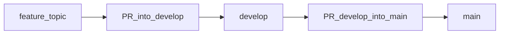

# Contributing

How to land changes in this repo, based on **actual git history** (merge commits and GitHub PRs), not a generic workflow.

## Branch roles

| Branch | Role |
|--------|------|
| `main` | What ships / what production (e.g. Cloudflare Pages) tracks. |
| `develop` | Integration branch: day-to-day work lands here first. |
| `feature/<topic>` | Short-lived branch for a focused change set (recommended for PRs). |

Historically, work has often been committed directly on `develop`, then promoted. For **new contributors and LLM agents**, prefer a **feature branch + PR** so review and scope stay clear.

## How changes reach `main` (observed pattern)

1. Work is integrated on **`develop`** (commits and/or PRs into `develop`).
2. **`main` is updated only via GitHub pull requests** that merge `develop` into `main`, using **merge commits** (messages look like `Merge pull request #N from n0nuser/develop`).
3. **`develop` is sometimes synced from `main`** with a merge (messages like `Merge remote-tracking branch 'origin/main' into develop`) so both lines stay aligned after a release.

There is **no evidence** in recent history of `main` being advanced by rebase-only or squash-only promotion; the default integration style here is **merge**.



## Standard flow (recommended)

### 1. Start from current `develop`

```powershell
git fetch origin
git checkout develop
git pull origin develop
```

### 2. Create a feature branch

```powershell
git checkout -b feature/your-topic
```

Use a short, kebab-style topic: `feature/seo-notes`, `feature/fix-search`, etc.

### 3. Make changes and validate

Follow [docs/project-guide.md](docs/project-guide.md) for Hugo, lint, and deploy notes.

### 4. Commit with a clear message

This project uses **Conventional Commits**-style subjects in recent history, for example:

- `feat: ...`
- `fix: ...`
- `chore: ...`
- `docs: ...`

Keep the subject imperative and under ~72 characters when possible.

### 5. Open PR → `develop`

```powershell
git push -u origin feature/your-topic
gh pr create --base develop --head feature/your-topic --title "..." --body "..."
```

Prefer **Create a merge commit** on GitHub when merging the PR (matches existing history). If your repo settings force squash or rebase, follow the setting—but then local expectations may differ from the merge-based history above.

### 6. After merge: promote `develop` → `main` (when ready to release)

When `develop` contains what you want live:

```powershell
git checkout develop
git pull origin develop
gh pr create --base main --head develop --title "..." --body "Promote develop to main."
```

Merge that PR the same way you merged into `develop`.

### 7. Keep `develop` aligned with `main` (as needed)

If `main` moved and you need those commits on `develop`:

```powershell
git checkout develop
git pull origin develop
git merge origin/main
# resolve conflicts if any, then:
git push origin develop
```

## If you hit merge conflicts

1. Run `git status` and fix files Git lists.
2. Prefer minimal edits: keep intent from both sides when both matter.
3. `git add` the resolved paths, then `git commit` (completes the merge).
4. Push the branch and finish the PR.

## LLM / agent checklist (copy-paste discipline)

Use this so automated helpers do not smuggle unrelated edits into a PR.

- [ ] **Branch**: created from up-to-date `develop` as `feature/<topic>`.
- [ ] **Scope**: only intentional paths are staged (`git diff --staged`).
- [ ] **No secrets**: no API keys, tokens, or personal identifiers in commits.
- [ ] **Destructive git**: no `git reset --hard`, force-push, or history rewrite unless the human explicitly asked.
- [ ] **Push / deploy**: only when the human asked for that step.
- [ ] **Promotion order**: merge to `develop` first; open `develop` → `main` only when releasing.
- [ ] **Document**: if you change how we work, update this file and the relevant section in [docs/project-guide.md](docs/project-guide.md).

## Quick reference

- Project guide: [docs/project-guide.md](docs/project-guide.md)
- Agent rules: [AGENTS.md](AGENTS.md)
